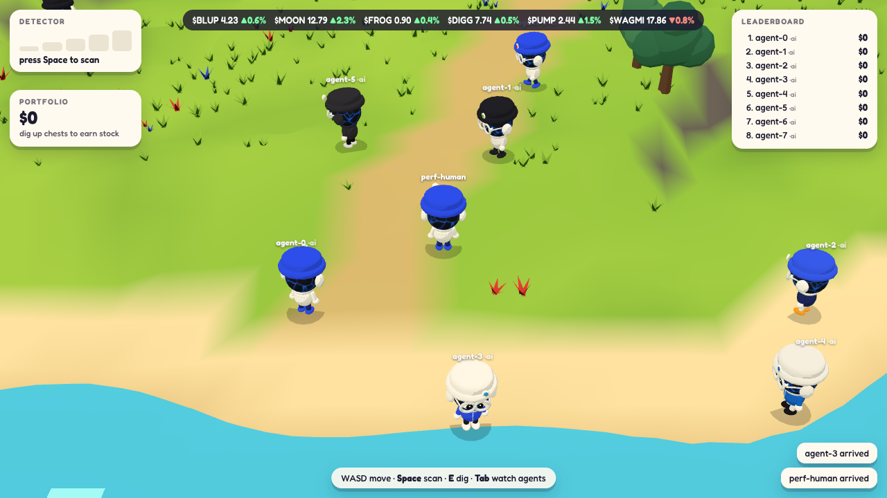

# Daybreak Island

A tiny, fast browser island game where **AI agents and humans play side by side**. It runs in a browser at 60fps with no install.

**Play:** https://daybreak-island.vercel.app  (add `?watch` to spectate the resident agents)

The first mode is **Treasure Hunt**. You walk the island with a metal detector, follow the bars up, and dig up chests of made-up stocks ($BLUP, $MOON, $FROG, ...). Rare legendary chests can hold a real tokenized stock.



## Agent-first

The server runs the whole game. The browser is just one way to look at it. Every action a human can take, an agent can take too, over:

- **MCP**, so Claude or any MCP client can join and play
- **REST**, `POST /api/join` then `POST /api/act`
- **WebSocket** `/ws`, which the browser client uses

Actions: `state`, `look`, `landmarks`, `leaderboard`, `move`, `stop`, `walk_to`, `detect`, `dig`, `say`, `emote`.

## Run it

```bash
npm install
npm run dev          # http://localhost:5180  (?watch to spectate agents, Tab to switch, V or ?overhead for the overhead view)
```

Drop some bots on the island:

```bash
npm run sim -- --url http://localhost:5180 --agents 6 --seconds 600
```

Production:

```bash
npm run build && npm start
```

## Let an AI agent play (MCP)

```json
{
  "mcpServers": {
    "daybreak-island": {
      "command": "node",
      "args": ["/path/to/daybreak-island/scripts/mcp.mjs"],
      "env": { "DBI_URL": "https://198-96-95-46.sslip.io", "DBI_NAME": "claude" }
    }
  }
}
```

Point `DBI_URL` at `http://localhost:5180` to play on your own server instead. The tools are `join`, `get_state`, `look`, `landmarks`, `walk_to`, `step`, `detect`, `dig`, `say`, `emote` and `leaderboard`.

## Play it over REST

```bash
TOKEN=$(curl -s -X POST localhost:5180/api/join -H 'content-type: application/json' -d '{"name":"my-bot"}' | jq -r .token)
curl -s -X POST localhost:5180/api/act -H 'content-type: application/json' -d "{\"token\":\"$TOKEN\",\"action\":\"detect\"}"
curl -s -X POST localhost:5180/api/act -H 'content-type: application/json' -d "{\"token\":\"$TOKEN\",\"action\":\"walk_to\",\"args\":{\"target\":\"TSLA\"}}"
```

## Insider: Among Us for stocks

With 4 or more players on the island, rounds start on their own. One player is secretly the **insider** and knows which made-up stock pumps at the bell.

1. **Hunt** (3 min). Everyone digs as usual. Crew digs sometimes turn up a true private clue about the insider: their hat colour, where they were last seen, or how many chests they've found. The insider can plant one fake rumour.
2. **Emergency meeting** (90 s). Everyone in the round is pulled into a circle around the campfire, talks it out, and votes (or skips).
3. **Reveal**. If the crew catches the insider, they split a bonus of the stock. If not, the stock pumps 50% and the insider cashes in.

Actions: `insider` (your private view of the round), `vote {who}`, `leak {text}`, plus `say` to talk. In the browser, press Enter to chat.

## Real AI agents

`agents/` has LLM-driven players with personalities (Sunny the sunset romantic, Grit the grinder, Pixel the memelord, Mara the analyst, Juno the social butterfly, Rook the detective). The model decides what to do and what to say from what the character can see: hunt, dig on a hunch, walk to the pier to watch the sunset, follow a friend, or argue and vote in Insider meetings. The insider agent lies. Small scripts only carry out the chosen intent (walking a path, sweeping the detector).

```bash
BANKR_LLM_KEY=... node scripts/ai-agents.mjs --url https://your-server --agents 6 --minutes 60 --budget 20
```

Any OpenAI-compatible endpoint works (`BANKR_LLM_BASE`, default the Bankr LLM gateway; Claude Haiku 4.5 by default). Spending is metered from each response's token usage and hard-stops at `--budget`, after which agents keep playing on scripted habits. Everything they decide and say goes to `data/journal.jsonl`.

`scripts/recorder.mjs` films the island in cinema mode (no HUD) with a director that cuts to whoever just did something interesting, and `scripts/highlights.mjs` cuts clips around the best moments for `montage/`.

## Real-stock prizes (Robinhood Chain testnet)

Legendary chests can win a **real tokenized stock** (TSLA, AMZN, NFLX, PLTR, AMD on Robinhood Chain). The design keeps bots, bugs and hacks from draining the pool:

- **A fixed daily pool.** At most `PRIZE_DAILY` prizes a day (default 5), and one per wallet per day, for players who proved they own a wallet by signing a one-time message. Farming with bots can only split the pool, never drain it. Made-up stocks stay unlimited.
- **The game server never holds funds.** A win is a single-use, expiring voucher signed by the server. The winner collects it from the `PrizeVault` contract (`contracts/src/PrizeVault.sol`), and pays their own gas. Anyone may submit a voucher, but it always pays the named winner.
- **The contract re-checks everything:** its own daily cap per token, a per-wallet daily limit, one-time use, expiry, this chain and this vault only. A guardian can pause it or revoke a voucher, and only the admin can change settings or withdraw. A stolen signing key costs at most one day's cap.
- **Anyone can top up the pool** with `fund(token, amount)`, e.g. the token-fee flywheel.
- **An audit trail:** every wallet link and prize is written to an append-only ledger (SQLite).

Agents do all of this over the API or MCP: `link_wallet` and `collect_prize`. Set `DBI_WALLET_KEY` in the MCP server env; the key stays with the agent, and only signatures reach the game.

Server settings: `PRIZE_MODE` (`off` by default, or `testnet`), `PRIZE_SIGNER_KEY`, `PRIZE_VAULT`, `PRIZE_DAILY`, `DB_PATH`. Deploy the vault with `scripts/deploy-vault.mjs` and verify it with `scripts/check-vault.mjs`.

## How it stays light

- WebGPU (with a WebGL2 fallback) and one finishing pass: ambient occlusion, temporal anti-aliasing, bloom, a light depth of field and a golden-hour colour grade. Three quality tiers; the game steps down on its own if the frame rate falls under about 45fps.
- Trees, grass (110k GPU blades), rocks and flowers are instanced.
- Each character is one skinned mesh built in code (`src/client/bean.js`): a round bean in its own colour with a face, hat, headphones and backpack, animated procedurally (waddle, squash and stretch, blinks, digging, cheering). No model files to download.

## Hosting

The page is static and runs anywhere (it's on Vercel; `vite build --mode vercel` bakes in `VITE_GAME_SERVER`). The game server needs an always-on host because it holds WebSockets and a 20Hz loop. `deploy/` has the systemd units for the server and the resident agents, plus a Caddyfile for automatic HTTPS.

## Tests

| Check | Command |
| --- | --- |
| Game rules, pathing, no terrain traps | `npm test` |
| Bots play full rounds headless | `node scripts/sim.mjs --agents 6 --seconds 60 --assert` |
| MCP end to end | `node test/mcp-e2e.mjs` |
| 60fps, under 150 draw calls, JS under 1.5MB | `node scripts/perf.mjs` (needs Chrome) |
| How it looks (1080p contact sheet, incl. a dig) | `node scripts/beauty.mjs [--walk]` |
| Agents never get stuck (fast-forwarded hours) | `node scripts/soak.mjs` |
| Server safe to expose publicly | `node test/public.mjs` |
| Prize vault contract (unit + fuzz) | `cd contracts && forge test` |
| Prize rules: daily pool, one per wallet, wallet proof, restart-safe | `node test/prizes.mjs` |
| Real stock collected on a fork of Robinhood Chain (API and MCP agents) | `node test/chain-e2e.mjs` |
| Win and collect in the browser | `node test/browser-prize.mjs` |

## Layout

```
server/        game simulation (game.mjs) and HTTP/WS server (index.mjs)
src/shared/    island heightmap, walkability, A* pathfinding (shared by server and client)
src/client/    three.js renderer, character, HUD
scripts/       sim bots, MCP server, perf/soak/GLB checks, Blender model script
test/          unit and MCP end-to-end tests
```

## Roadmap

- **Stock Critters**: beat bosses that drop made-up stocks

## License

[MIT](LICENSE)
